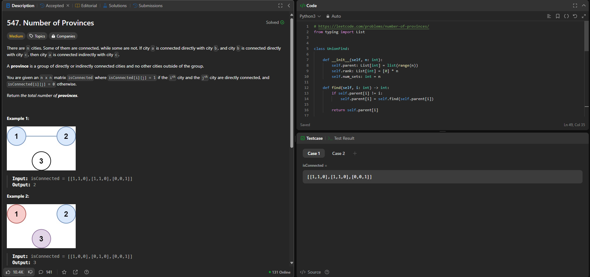

# Grafos2_Leet

**Conteúdo da Disciplina**: Grafos 2 

## Alunos
|Matrícula | Aluno |
| -- | -- |
| 211031744  |  Júlio César Costa |
| 211031403  |  Marcus Vinicius Cunha Dantas |

## Sobre 
Este projeto visa resolver questões do leetcode relacionadas a grafos(Dijkstra, SCC, Prim, Kruskal) com dificuldades médias e difíceis

| Problema | Nome                                   | Dificuldade |
|----------|----------------------------------------|-------------|
| 547      | [Number of Provinces](https://leetcode.com/problems/number-of-provinces/description/)                        | Médio       |
| 2642     | [Design Graph With Shortest Path Calculator](https://leetcode.com/problems/design-graph-with-shortest-path-calculator/)                        | Difícil     |
| -        |                         | Médio       |
| -        |                         | Difícil     |

## Screenshots

### [Number of Provinces](https://leetcode.com/problems/number-of-provinces/description/)

### [Design Graph With Shortest Path Calculator](https://leetcode.com/problems/design-graph-with-shortest-path-calculator/)

### 

### 

## Outros 

[Apresentação no Youtube]()

